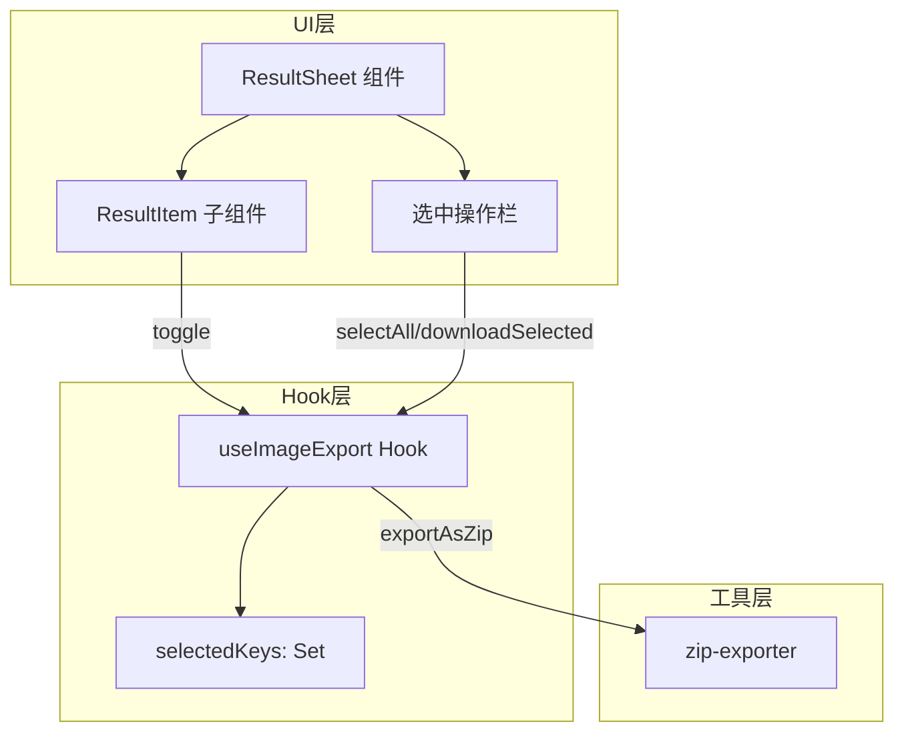
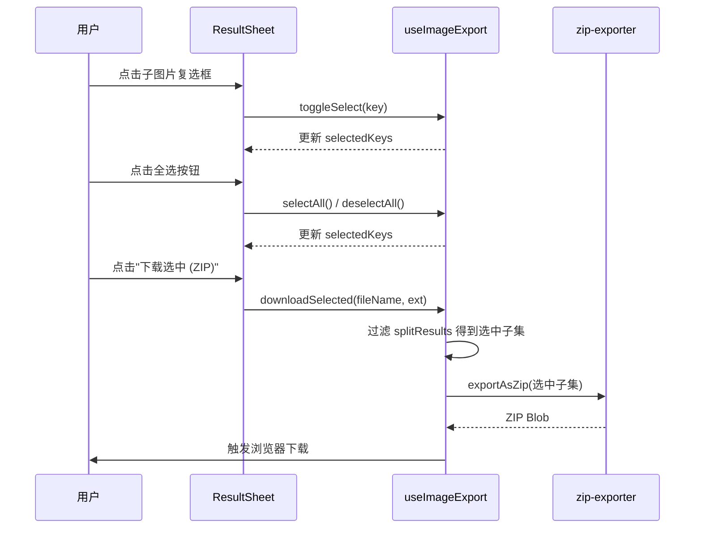

# 技术设计文档

## 概览

**目的**: 本功能为分割结果面板新增多选批量下载能力，让用户可以勾选任意数量的子图片并打包为 ZIP 下载，填补"全部下载"与"逐张下载"之间的粒度空白。

**用户**: 所有使用图片分割功能的用户，在生成分割结果后需要选择性下载部分子图片。

**影响**: 扩展现有 `ResultSheet` 组件和 `useImageExport` Hook，不修改核心分割与导出逻辑。

### 目标
- 在结果面板中为每张子图片提供复选框，支持单选和全选切换
- 将选中图片打包为 ZIP 下载，与现有"下载全部"功能并行
- 实时显示选中数量，提供清晰的交互反馈

### 非目标
- 不修改现有"下载全部"和"单张下载"功能
- 不引入跨会话的选中状态持久化
- 不支持拖拽多选或键盘快捷键批量选择

## 架构

### 现有架构分析

当前下载流程：
- `useImageExport` Hook 管理 `splitResults` 状态和所有导出方法
- `ResultSheet` 为纯展示组件，通过 props 接收结果和回调
- `zip-exporter.ts` 提供 `exportAsZip`（接收任意 `SplitResult[]`）和 `downloadSingle`
- `ZipExportOptions` 类型已支持传入结果子集

**关键约束**: `ResultSheet` → `useImageExport` 的单向数据流必须保持。

### 架构模式与边界

**选定模式**: 扩展现有 Hook + 组件模式，在 `useImageExport` 中新增选中状态管理。



**架构决策**:
- 选中状态放在 `useImageExport` 中，与导出逻辑集中管理
- `ResultSheet` 通过新增 props 接收选中状态和回调
- 复用现有 `exportAsZip`，仅传入选中子集

### 技术栈

| 层 | 选择/版本 | 在本功能中的角色 | 备注 |
|----|----------|----------------|------|
| 前端 UI | React 19 + shadcn/ui | 复选框控件、按钮状态 | 复用 Checkbox 组件 |
| 状态管理 | React useState (Set) | 管理选中键集合 | 在 useImageExport 中 |
| 导出 | JSZip 3.x | ZIP 打包选中子集 | 已有依赖，无需新增 |

## 系统流程



## 需求追踪

| 需求 | 摘要 | 组件 | 接口 | 流程 |
|------|------|------|------|------|
| 1.1 | 显示复选框控件 | ResultItem | ResultItemProps | - |
| 1.2 | 切换选中状态与视觉反馈 | ResultItem, useImageExport | toggleSelect | 选中切换 |
| 1.3 | 全选按钮 | ResultSheet | selectAll | 全选流程 |
| 1.4 | 全选切换为全不选 | ResultSheet | selectAll/deselectAll | 全选流程 |
| 1.5 | 显示选中数量 | ResultSheet | selectedKeys.size | - |
| 2.1 | 显示"下载选中"按钮 | ResultSheet | selectedKeys.size | - |
| 2.2 | 打包选中图片为 ZIP | useImageExport | downloadSelected | 批量下载 |
| 2.3 | ZIP 命名 `_selected.zip` | zip-exporter | getSelectedZipFileName | - |
| 2.4 | ZIP 内文件沿用命名规则 | zip-exporter | exportAsZip（复用） | - |
| 2.5 | 未选中时禁用按钮 | ResultSheet | selectedKeys.size === 0 | - |
| 2.6 | 下载后保持选中状态 | useImageExport | downloadSelected 不清除 | - |
| 3.1 | 保留"下载全部"功能 | ResultSheet | onDownloadAll（不变） | - |
| 3.2 | 保留单张下载功能 | ResultItem | onDownload（不变） | - |
| 3.3 | 关闭面板重置选中 | useImageExport | clearSelection | - |
| 3.4 | 重新生成重置选中 | useImageExport | clearResults 联动 | - |

## 组件与接口

| 组件 | 域/层 | 职责 | 需求覆盖 | 关键依赖 | 合约 |
|------|-------|------|----------|----------|------|
| useImageExport | Hook | 选中状态管理 + 批量导出 | 1.2-1.4, 2.2-2.6, 3.3-3.4 | zip-exporter (P0) | State, Service |
| ResultSheet | UI | 展示选中操作栏 | 1.3-1.5, 2.1, 2.5, 3.1 | useImageExport (P0) | - |
| ResultItem | UI | 复选框交互 + 选中样式 | 1.1, 1.2, 3.2 | - | - |
| zip-exporter | 工具 | 新增文件名辅助函数 | 2.3, 2.4 | JSZip (P0) | Service |

### Hook 层

#### useImageExport（扩展）

| 字段 | 详情 |
|------|------|
| 职责 | 在现有分割导出基础上，新增选中状态管理和批量下载 |
| 需求 | 1.2, 1.3, 1.4, 2.2, 2.3, 2.5, 2.6, 3.3, 3.4 |

**职责与约束**
- 使用 `Set<string>` 管理选中键（键格式: `${row}-${col}`）
- 提供 `toggleSelect`、`selectAll`、`deselectAll`、`clearSelection` 方法
- 提供 `downloadSelected` 方法，过滤 `splitResults` 并调用 `exportAsZip`
- `clearResults` 调用时联动清除选中状态

**依赖**
- 出站: `zip-exporter` — ZIP 打包 (P0)

**合约**: State [x] / Service [x]

##### 状态管理

```typescript
// 新增状态
selectedKeys: Set<string>  // 选中的子图片键集合

// 辅助函数
function getResultKey(result: SplitResult): string
// 返回 `${result.row}-${result.col}`
```

##### 服务接口

```typescript
// 新增方法（追加到现有 UseImageExportReturn）
interface UseImageExportReturn {
  // ... 现有方法保持不变 ...

  /** 选中的子图片键集合 */
  selectedKeys: ReadonlySet<string>
  /** 切换单张图片的选中状态 */
  toggleSelect: (key: string) => void
  /** 全选所有子图片 */
  selectAll: () => void
  /** 取消全选 */
  deselectAll: () => void
  /** 清除选中状态 */
  clearSelection: () => void
  /** 下载选中的子图片为 ZIP */
  downloadSelected: (
    originalFileName: string,
    fileExtension: string
  ) => Promise<void>
}
```

- 前置条件: `downloadSelected` 要求 `selectedKeys.size > 0`
- 后置条件: `downloadSelected` 完成后 `selectedKeys` 保持不变
- 不变量: `clearResults()` 调用后 `selectedKeys` 必须为空集

**实现备注**
- `selectAll` 从当前 `splitResults` 生成所有键
- `downloadSelected` 使用 `selectedKeys` 过滤 `splitResults` 后传入 `exportAsZip`
- ZIP 文件名通过 `getSelectedZipFileName` 生成

### 工具层

#### zip-exporter（扩展）

| 字段 | 详情 |
|------|------|
| 职责 | 新增批量下载 ZIP 文件名生成函数 |
| 需求 | 2.3 |

**合约**: Service [x]

##### 服务接口

```typescript
// 新增函数
function getSelectedZipFileName(originalFileName: string): string
// 返回 `${originalFileName}_selected.zip`
```

**实现备注**
- 现有 `exportAsZip` 无需修改，已支持传入任意 `SplitResult[]` 子集
- 现有 `getZipFileName` 保持不变（返回 `_split.zip`）

### UI 层

#### ResultSheet（扩展）

需求覆盖: 1.3, 1.4, 1.5, 2.1, 2.5, 3.1

**Props 扩展**:

```typescript
interface ResultSheetProps {
  // ... 现有 props 不变 ...

  /** 选中的子图片键集合 */
  selectedKeys: ReadonlySet<string>
  /** 切换选中状态 */
  onToggleSelect: (key: string) => void
  /** 全选/取消全选 */
  onSelectAll: () => void
  /** 是否全部选中 */
  isAllSelected: boolean
  /** 下载选中图片 */
  onDownloadSelected: () => void
}
```

**UI 变更**:
- Header 区域：显示"已选 N/M 张"计数
- "下载全部"按钮下方：新增"全选"复选框和"下载选中 (ZIP)"按钮
- "下载选中"按钮在 `selectedKeys.size === 0` 时显示为禁用状态
- 按钮文案包含选中数量，如"下载选中 (3)"

#### ResultItem（扩展）

需求覆盖: 1.1, 1.2, 3.2

**Props 扩展**:

```typescript
// ResultItem 新增 props
{
  /** 当前图片是否选中 */
  selected: boolean
  /** 切换选中回调 */
  onToggleSelect: () => void
}
```

**UI 变更**:
- 缩略图左上角叠加一个 Checkbox 控件
- 选中时：边框高亮为金色 `#D4AF37`，Checkbox 显示勾选状态
- 未选中时：Checkbox 显示为空心，正常边框样式
- 点击 Checkbox 区域切换选中，不影响图片预览点击

## 错误处理

### 错误策略
本功能为纯客户端操作，错误场景有限。

### 错误类别与响应
- **ZIP 生成失败**（内存不足）: 复用现有 `exportAsZip` 的 Promise rejection 处理，向用户显示错误提示
- **空选中下载**: 通过按钮禁用状态从 UI 层防止，无需运行时错误处理

## 测试策略

### 单元测试
1. `getSelectedZipFileName` — 验证返回 `{name}_selected.zip` 格式
2. `useImageExport.toggleSelect` — 验证选中/取消选中切换
3. `useImageExport.selectAll` — 验证全选生成正确的键集合
4. `useImageExport.downloadSelected` — 验证仅传入选中子集给 `exportAsZip`
5. `useImageExport.clearResults` — 验证联动清除选中状态

### 组件测试
1. `ResultItem` — 验证 Checkbox 渲染和点击切换
2. `ResultSheet` — 验证选中计数显示、全选按钮、禁用状态
3. `ResultSheet` — 验证关闭面板触发选中重置
