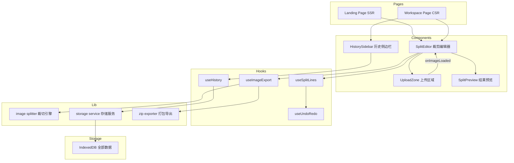
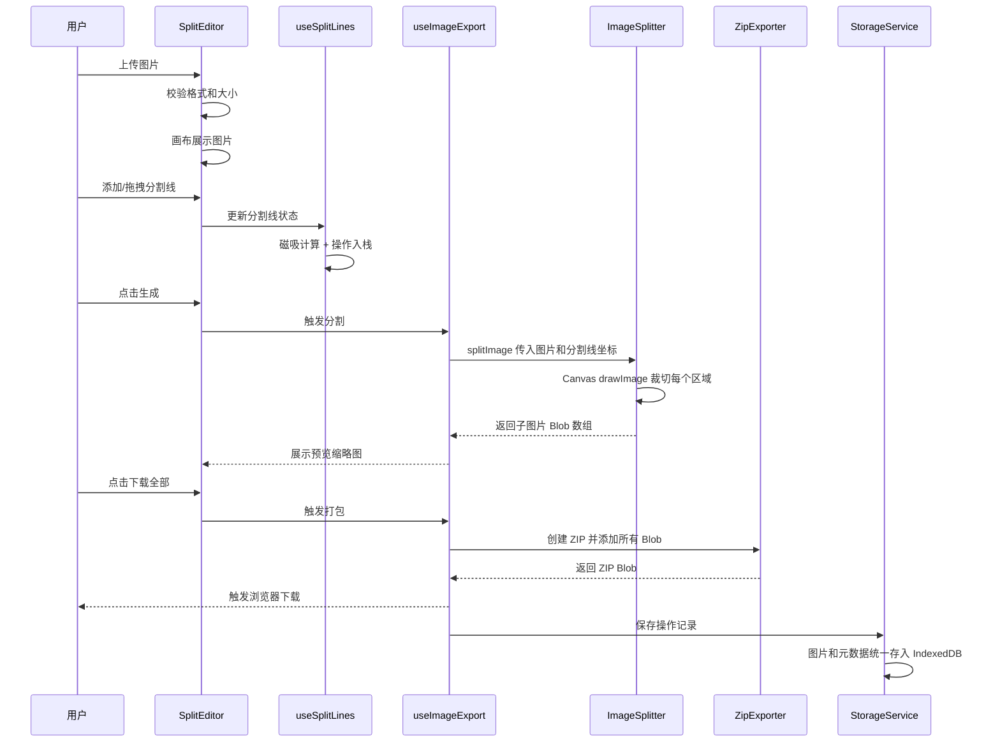
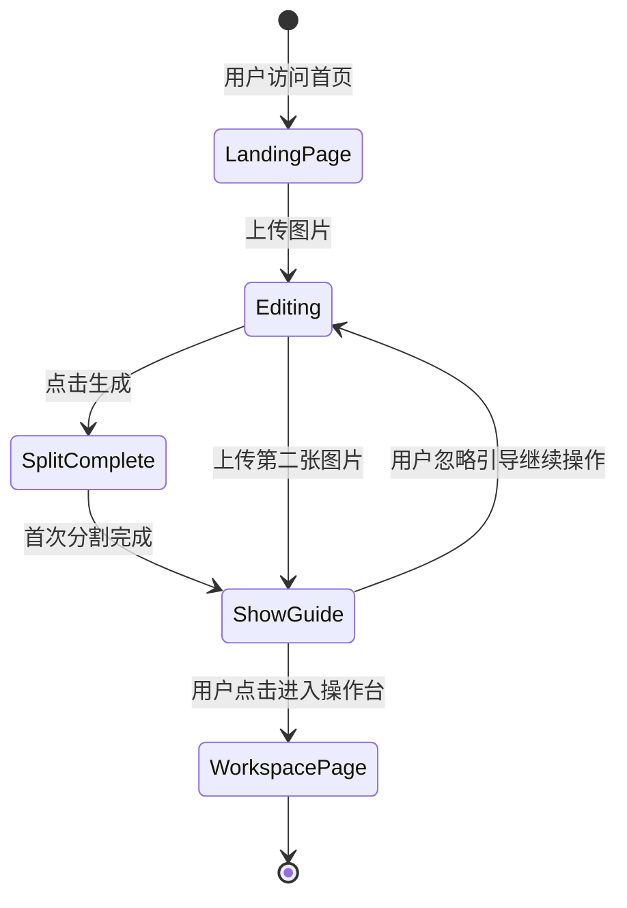
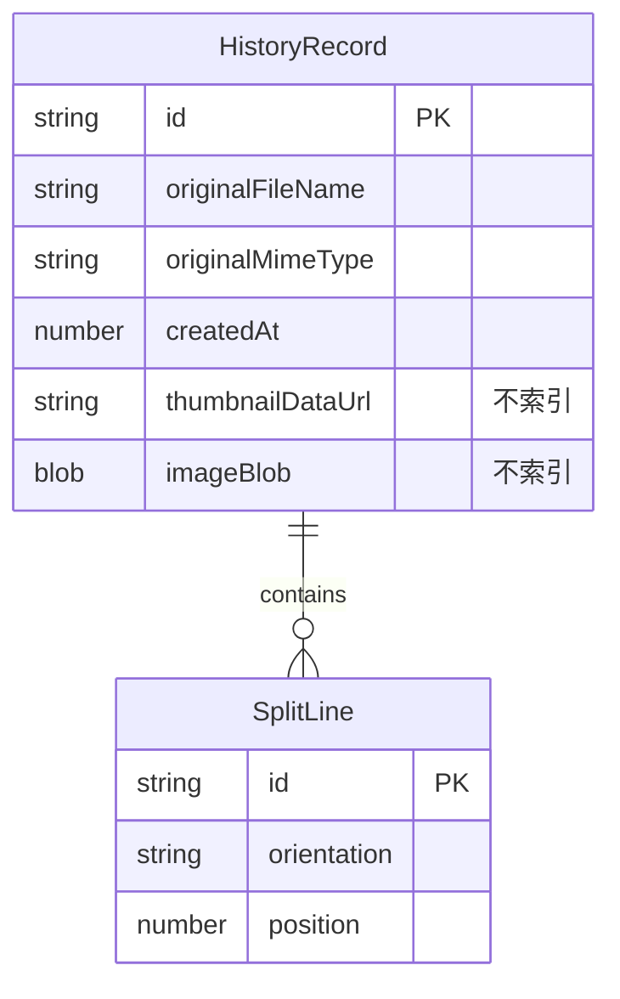

# 设计文档

## 概述

**用途**: 在线图片分割工具为普通用户和设计师提供浏览器端的图片裁切服务，支持拖拽分割线、磁吸对齐、一键生成并下载所有子图片。

**用户**: 设计师、内容创作者和普通用户通过落地页快速完成单次裁切，或进入操作台进行多图管理和历史记录回溯。

**影响**: 这是一个全新的 Greenfield 项目，从零构建前端应用。

### 目标
- 提供流畅的画布交互体验（分割线拖拽、磁吸、撤销/重做）
- 落地页兼顾 SEO 和即时可用的裁剪功能，最大化转化率
- 操作台提供完整的多图管理和历史记录功能
- 所有数据处理在客户端完成，零隐私风险

### 非目标
- 不支持 AI 智能分割（如物体识别、边缘检测），未来可扩展
- 不支持服务端处理或用户账号系统
- 不针对移动端优化精细交互（如分割线拖拽），仅保证基本可用
- 不支持批量上传多张图片同时处理

## 架构

### 架构模式与边界映射

采用**分层架构**（UI → Hooks → Lib），与 steering `structure.md` 定义的组织模式一致。



**架构集成**:
- 选择模式：分层架构（UI → Hooks → Lib）
- 领域边界：裁剪编辑（SplitEditor）、历史管理（HistorySidebar）、数据存储（StorageService）三个独立领域
- 保留模式：遵循 steering 定义的 `components/` → `hooks/` → `lib/` 单向依赖
- 新组件理由：SplitEditor 作为共享核心组件被落地页和操作台复用
- Steering 合规：PascalCase 组件、camelCase hooks、`@/` 路径别名

### 技术栈

| 层级 | 选择 / 版本 | 功能角色 | 备注 |
|------|------------|---------|------|
| 框架 | Next.js 15 App Router | SSR/SSG 落地页 + CSR 操作台 | 双层 dynamic import 模式加载 Canvas |
| 语言 | TypeScript strict | 全项目类型安全 | 禁用 `any` |
| UI 组件库 | shadcn/ui | 按钮、对话框、Toast 等基础组件 | 源码级引入 |
| CSS | Tailwind CSS | 样式系统 | 与 shadcn/ui 配合 |
| Canvas 交互 | react-konva 19.2.0 + Konva 10.2.0 | 分割线拖拽、磁吸、画布渲染 | `ssr: false` 动态加载 |
| 图片处理 | Canvas API | drawImage 裁切 + toBlob 导出 | 原生浏览器 API |
| ZIP 打包 | JSZip 3.10.1 | 客户端 ZIP 生成 | 按需 dynamic import |
| 数据存储 | Dexie.js 4.x | IndexedDB 封装 + React useLiveQuery | 详见 `research.md` 选型对比 |
| 包管理 | Bun | 安装/开发/构建/测试 | — |

## 系统流程

### 图片分割主流程



### 落地页到操作台引导流程



## 需求追踪

| 需求 | 摘要 | 组件 | 接口 | 流程 |
|------|------|------|------|------|
| 1.1-1.3 | 图片上传与展示 | UploadZone, SplitEditor | UploadZone Props | 主流程-上传 |
| 1.4-1.5 | 上传校验 | UploadZone | ValidationResult | 主流程-校验 |
| 2.1-2.3 | 分割线添加与拖拽 | SplitEditor | useSplitLines | 主流程-编辑 |
| 2.4, 2.7 | 磁吸与边界约束 | SplitEditor | SnapService | 主流程-编辑 |
| 2.5 | 分割线删除 | SplitEditor | useSplitLines | 主流程-编辑 |
| 2.6 | 分割预览 | SplitEditor | — | 主流程-编辑 |
| 2.8 | 分割线数量限制 | SplitEditor | useSplitLines | — |
| 2.9-2.10 | 撤销/重做 | SplitEditor | useUndoRedo | — |
| 3.1-3.2 | 图片分割与预览 | SplitPreview | ImageSplitter | 主流程-生成 |
| 3.3-3.4 | ZIP 打包与命名 | SplitPreview | ZipExporter | 主流程-下载 |
| 3.5, 3.7 | 单独下载与格式 | SplitPreview | ImageSplitter | 主流程-下载 |
| 3.6, 3.8 | 画质保持与空校验 | SplitPreview, SplitEditor | ImageSplitter | — |
| 4.1-4.4 | 落地页 SEO + 引导 | LandingPage | — | 引导流程 |
| 5.1-5.6 | 操作台布局与交互 | WorkspacePage, HistorySidebar | useHistory | — |
| 6.1-6.6 | 历史记录管理 | HistorySidebar | StorageService | 主流程-保存 |
| 7.1-7.5 | 响应式与隐私 | 全局 | — | — |

## 组件与接口

### 组件总览

| 组件 | 领域/层级 | 职责 | 需求覆盖 | 关键依赖 | 契约 |
|------|----------|------|---------|----------|------|
| LandingPage | 页面 | SEO 内容 + 裁剪入口 | 4.1-4.4 | SplitEditor (P0) | — |
| WorkspacePage | 页面 | 操作台布局 | 5.1-5.6 | SplitEditor (P0), HistorySidebar (P0) | — |
| SplitEditor | UI 组件 | 核心裁剪编辑器 | 1.1-2.10, 3.6, 3.8 | useSplitLines (P0), useImageExport (P0) | State |
| UploadZone | UI 组件 | 图片上传区域 | 1.1-1.5 | — | — |
| SplitPreview | UI 组件 | 分割结果预览与下载 | 3.1-3.8 | useImageExport (P0) | — |
| HistorySidebar | UI 组件 | 历史记录侧边栏 | 5.2-5.4, 6.1-6.6 | useHistory (P0) | — |
| useSplitLines | Hook | 分割线状态管理 | 2.1-2.10 | useUndoRedo (P0) | State |
| useUndoRedo | Hook | 撤销/重做栈 | 2.9-2.10 | — | State |
| useHistory | Hook | 历史记录 CRUD | 6.1-6.6 | StorageService (P0) | State |
| useImageExport | Hook | 分割与导出调度 | 3.1-3.8 | ImageSplitter (P0), ZipExporter (P1) | Service |
| ImageSplitter | Lib | Canvas 裁切引擎 | 3.1, 3.6, 3.7 | — | Service |
| ZipExporter | Lib | ZIP 打包 | 3.3-3.4 | JSZip (P0 External) | Service |
| StorageService | Lib | IndexedDB 统一存储封装 | 6.1-6.6 | Dexie.js (P0 External) | Service, State |

---

### Lib 层

#### ImageSplitter

| 字段 | 详情 |
|------|------|
| 职责 | 使用 Canvas API 将图片按分割线坐标裁切为多个子图片 |
| 需求 | 3.1, 3.6, 3.7 |

**职责与约束**
- 接收原始图片和分割线坐标，输出裁切后的 Blob 数组
- 以原始分辨率裁切，不缩放不压缩
- 跟踪并保持原始图片格式（WebP 统一为 PNG）

**依赖**
- External: Canvas API — 图片裁切核心 (P0)

**契约**: Service [x]

##### 服务接口
```typescript
interface SplitLine {
  id: string
  orientation: 'horizontal' | 'vertical'
  position: number // 像素坐标（相对于原始图片）
}

interface SplitResult {
  row: number       // 从 1 开始
  col: number       // 从 1 开始
  blob: Blob
  width: number
  height: number
}

interface ImageSplitterService {
  splitImage(
    image: HTMLImageElement,
    lines: SplitLine[],
    originalMimeType: string
  ): Promise<SplitResult[]>
}
```
- 前置条件: image 已加载完成，lines 坐标在图片范围内
- 后置条件: 返回的 SplitResult 数组覆盖图片所有区域，无遗漏无重叠
- 不变量: 所有子图片宽高之和等于原始图片尺寸

**实现备注**
- 为每个区域创建独立 Canvas，使用 `drawImage()` 9 参数裁切
- `toBlob(cb, mimeType, quality)` 导出，JPEG quality 设为 0.92
- WebP 输入检测后替换 mimeType 为 `image/png`

---

#### ZipExporter

| 字段 | 详情 |
|------|------|
| 职责 | 将多个 SplitResult 打包为 ZIP 文件 |
| 需求 | 3.3, 3.4 |

**职责与约束**
- 按命名规则 `{原始文件名}_r{行号}_c{列号}.{格式}` 组织子图片
- ZIP 文件命名为 `{原始文件名}_split.zip`

**依赖**
- External: JSZip 3.10.1 — ZIP 生成 (P0)，通过 `dynamic import()` 按需加载

**契约**: Service [x]

##### 服务接口
```typescript
interface ZipExportOptions {
  originalFileName: string
  results: SplitResult[]
  fileExtension: string
}

interface ZipExporterService {
  exportAsZip(options: ZipExportOptions): Promise<Blob>
  downloadSingle(result: SplitResult, fileName: string): void
}
```
- 前置条件: results 非空
- 后置条件: 返回有效的 ZIP Blob，包含所有子图片

---

#### StorageService

| 字段 | 详情 |
|------|------|
| 职责 | 封装 IndexedDB（Dexie.js）统一管理图片 Blob 和元数据 |
| 需求 | 6.1-6.6 |

**职责与约束**
- 图片 Blob 和元数据**统一存储在 IndexedDB**（通过 Dexie.js），以支持 `useLiveQuery` 响应式查询
- Dexie schema 中仅索引元数据字段（id, createdAt），**不索引 Blob 和 thumbnailDataUrl**
- 历史记录上限 50 条，超限自动清理最早记录
- 删除记录时级联删除对应图片 Blob

**依赖**
- External: Dexie.js 4.x — IndexedDB 封装 (P0)

**契约**: Service [x] / State [x]

##### 服务接口
```typescript
interface HistoryRecord {
  id: string
  originalFileName: string
  originalMimeType: string
  lines: SplitLine[]
  createdAt: number           // Unix timestamp
  thumbnailDataUrl: string    // 缩略图 base64，不被 Dexie 索引
  imageBlob: Blob             // 原始图片 Blob，不被 Dexie 索引
}

// Dexie schema 定义：仅索引查询需要的字段
// db.version(1).stores({ history: '++id, createdAt' })
// imageBlob 和 thumbnailDataUrl 作为普通属性存储但不索引

interface StorageServiceInterface {
  saveRecord(
    record: Omit<HistoryRecord, 'id' | 'createdAt'>
  ): Promise<HistoryRecord>

  getRecords(): Promise<HistoryRecord[]>

  getRecord(id: string): Promise<HistoryRecord | undefined>

  deleteRecord(id: string): Promise<void>

  getStorageUsage(): Promise<{ used: number; quota: number }>
}
```
- 前置条件: 浏览器支持 IndexedDB
- 后置条件: 保存后记录可通过 `useLiveQuery` 实时查询到
- 不变量: 记录数不超过 50 条

##### 状态管理
- Dexie `useLiveQuery(() => db.history.orderBy('createdAt').reverse().toArray())` 驱动历史记录列表的响应式更新
- 新增/删除记录时 UI 自动刷新，无需手动状态同步

---

### Hooks 层

#### useSplitLines

| 字段 | 详情 |
|------|------|
| 职责 | 管理分割线的增删改状态，包含磁吸计算和数量限制 |
| 需求 | 2.1-2.8 |

**契约**: State [x]

##### 状态管理
```typescript
interface UseSplitLinesOptions {
  imageWidth: number
  imageHeight: number
  snapThreshold?: number    // 默认 8px
  maxLinesPerDirection?: number  // 默认 20
}

interface UseSplitLinesReturn {
  lines: SplitLine[]
  addLine: (orientation: 'horizontal' | 'vertical') => void
  updateLinePosition: (id: string, position: number) => void
  removeLine: (id: string) => void
  canAddHorizontal: boolean
  canAddVertical: boolean
  calculateSnap: (position: number, orientation: 'horizontal' | 'vertical') => number
  undo: () => void
  redo: () => void
  canUndo: boolean
  canRedo: boolean
}
```

**实现备注**
- 磁吸目标：图片边缘（0, width/height）、其他分割线位置
- 新分割线默认添加到画布中央位置
- 集成 useUndoRedo 记录每次操作

---

#### useUndoRedo

| 字段 | 详情 |
|------|------|
| 职责 | 状态快照栈，支持撤销/重做 |
| 需求 | 2.9, 2.10 |

**契约**: State [x]

##### 状态管理
```typescript
interface UseUndoRedoOptions<T> {
  initialState: T
  maxStackSize?: number  // 默认 50
}

interface UseUndoRedoReturn<T> {
  state: T
  setState: (newState: T) => void   // 推入新快照
  undo: () => void
  redo: () => void
  canUndo: boolean
  canRedo: boolean
}
```

**实现备注**
- 快照模式：每次操作保存完整的 `SplitLine[]` 状态快照
- 分割线数据量小（每条约 3 个字段），50 层快照内存开销可忽略
- 执行新操作时清空 redo 栈
- 仅对分割线状态生效（添加、移动、删除均触发快照保存）

---

#### useHistory

| 字段 | 详情 |
|------|------|
| 职责 | 历史记录 CRUD + 响应式列表 |
| 需求 | 6.1-6.6 |

**契约**: State [x]

##### 状态管理
```typescript
interface UseHistoryReturn {
  records: HistoryRecord[]         // Dexie useLiveQuery 驱动
  isLoading: boolean
  saveCurrentWork: (
    record: Omit<HistoryRecord, 'id' | 'createdAt'>
  ) => Promise<void>
  loadRecord: (id: string) => Promise<HistoryRecord | undefined>
  deleteRecord: (id: string) => Promise<void>
  storageInfo: { used: number; quota: number }
}
```

---

#### useImageExport

| 字段 | 详情 |
|------|------|
| 职责 | 编排图片分割和导出流程 |
| 需求 | 3.1-3.8 |

**契约**: Service [x]

##### 服务接口
```typescript
interface UseImageExportReturn {
  splitResults: SplitResult[]
  isSplitting: boolean
  generateSplit: (
    image: HTMLImageElement,
    lines: SplitLine[],
    mimeType: string
  ) => Promise<void>
  downloadAll: (originalFileName: string, fileExtension: string) => Promise<void>
  downloadSingle: (result: SplitResult, fileName: string) => void
}
```

---

### UI 组件层

#### SplitEditor

| 字段 | 详情 |
|------|------|
| 职责 | 核心裁剪编辑器，组合上传、画布、分割线和结果预览 |
| 需求 | 1.1-3.8 |

**契约**: State [x]

##### Props 接口
```typescript
interface SplitEditorProps {
  /** 操作完成回调（落地页用于触发引导逻辑） */
  onSplitComplete?: (isFirstSplit: boolean) => void
  /** 上传回调（落地页用于检测第二次上传） */
  onImageUpload?: (uploadCount: number) => void
  /** 外部传入的初始状态（操作台从历史记录还原） */
  initialState?: {
    imageBlob: Blob
    lines: SplitLine[]
    originalFileName: string
    originalMimeType: string
  }
  /** 是否显示键盘快捷键提示 */
  showShortcutHints?: boolean
}
```

**职责与约束**
- 落地页和操作台共享的核心组件
- 包含 react-konva Stage/Layer 画布
- 管理图片状态（当前图片、原始文件信息）
- 协调 UploadZone、分割线编辑和 SplitPreview

**画布缩放与坐标系**
- 画布使用"适配缩放"策略：`scale = Math.min(canvasWidth / imageWidth, canvasHeight / imageHeight)`
- 分割线在**画布坐标系**下拖拽，提交给 ImageSplitter 前需转换为**原始图片坐标**：`originalPosition = canvasPosition / scale`
- react-konva `<Stage>` 设置 `scaleX={scale}` `scaleY={scale}` 实现统一缩放，分割线坐标始终基于原始图片尺寸

**键盘快捷键**
- 撤销（Ctrl/Cmd+Z）和重做（Ctrl/Cmd+Shift+Z）仅在编辑器容器获得焦点时生效
- 删除键（Delete/Backspace）仅在有分割线被选中时生效
- 通过 `tabIndex={0}` + `onKeyDown` 在编辑器容器 div 上监听，避免与浏览器默认行为冲突

**依赖**
- Inbound: LandingPage, WorkspacePage — 页面容器 (P0)
- Outbound: useSplitLines — 分割线状态 (P0)
- Outbound: useImageExport — 分割导出 (P0)
- External: react-konva 19.2.0 — Canvas 渲染 (P0)

**实现备注**
- 必须通过 `dynamic(() => import(...), { ssr: false })` 加载
- `'use client'` 组件
- 工具栏包含：添加横向/纵向分割线按钮、生成按钮、下载按钮

---

#### UploadZone

| 字段 | 详情 |
|------|------|
| 职责 | 图片上传区域（拖拽 + 文件选择） |
| 需求 | 1.1-1.5 |

**实现备注**
- 接受格式：PNG、JPG、JPEG、WebP
- 文件大小限制：20MB
- 拖拽上传使用原生 HTML5 Drag & Drop API
- 上传成功回调传递 `{ file: File, image: HTMLImageElement, mimeType: string }`

---

#### SplitPreview

| 字段 | 详情 |
|------|------|
| 职责 | 展示分割结果缩略图和下载操作 |
| 需求 | 3.1-3.8 |

**实现备注**
- 网格布局展示子图片缩略图
- 每个缩略图有单独下载按钮
- 顶部"下载全部"按钮触发 ZIP 打包

---

#### HistorySidebar

| 字段 | 详情 |
|------|------|
| 职责 | 历史记录列表展示与操作 |
| 需求 | 5.2-5.4, 6.1-6.6 |

**实现备注**
- 使用 useHistory hook 获取响应式记录列表
- 每条记录展示缩略图 + 文件名 + 时间
- 点击加载历史状态，右键/滑动删除
- "新建"按钮清空当前画布

---

### 页面层

#### LandingPage (`app/page.tsx`)

| 字段 | 详情 |
|------|------|
| 职责 | SEO 落地页 + 裁剪功能入口 |
| 需求 | 4.1-4.4 |

**实现备注**
- Server Component，通过 `metadata` 导出提供 SEO 信息
- SEO 内容（标题、功能介绍、使用说明、FAQ）由服务端渲染
- SplitEditor 通过 dynamic import（`ssr: false`）客户端加载
- 引导逻辑：首次分割完成或上传第二张图片时，Toast 提示进入操作台

#### WorkspacePage (`app/workspace/page.tsx`)

| 字段 | 详情 |
|------|------|
| 职责 | 完整操作台 |
| 需求 | 5.1-5.6 |

**实现备注**
- `'use client'` 页面
- 左侧 HistorySidebar + 右侧 SplitEditor 双栏布局
- 支持直接 URL 访问

## 数据模型

### 领域模型



**存储策略**:
- **IndexedDB（Dexie.js）统一存储**: 单表 `history`，包含元数据和图片 Blob
- **Dexie schema**: `'++id, createdAt'` — 仅索引 id 和时间戳，Blob 和 thumbnailDataUrl 作为普通属性存储不索引
- 统一存储使得 `useLiveQuery` 可以驱动历史记录列表的响应式更新

**不变量**:
- 记录总数不超过 50 条
- Blob 和 thumbnailDataUrl 不被 Dexie 索引（避免性能问题）

## 错误处理

### 错误策略

采用用户友好的 Toast 通知 + 内联提示结合。

### 错误类别与响应

**用户错误**:
- 不支持的文件格式 → UploadZone 内联错误提示，列出支持的格式
- 文件超过 20MB → Toast 提示"文件过大，建议压缩后重试"
- 无分割线时点击生成 → Toast 提示"请先添加分割线"
- 分割线数量达上限 → 禁用添加按钮 + Tooltip 说明

**系统错误**:
- Canvas toBlob 失败 → Toast 提示"图片处理失败，请刷新重试"
- IndexedDB 写入失败 → Toast 提示"保存失败"+ 提供手动下载当前结果
- 存储空间不足 → Toast 提示 + 引导用户到历史记录清理旧数据

## 测试策略

### 单元测试
- ImageSplitter: 验证裁切坐标计算、格式保持（PNG→PNG, JPG→JPG, WebP→PNG）
- useSplitLines: 添加/删除/移动分割线、磁吸阈值、数量上限
- useUndoRedo: 操作栈入栈/撤销/重做、redo 栈清理
- StorageService: 保存/读取/删除记录、50 条上限自动清理

### 集成测试
- 完整上传→添加分割线→生成→下载流程
- 历史记录保存→加载→还原分割线状态
- 落地页引导逻辑触发条件（首次分割、第二次上传）

### E2E 测试
- 落地页 SEO 元素渲染验证
- 图片上传→分割→ZIP 下载完整流程
- 操作台历史记录交互

### 性能测试
- 大图片（20MB）裁切耗时
- 20 条分割线时画布拖拽帧率（≥ 30fps）
- 50 条历史记录时列表渲染性能

## 性能与可扩展性

### 性能目标
- 画布拖拽操作帧率 ≥ 30fps（20 条分割线场景）
- 单次裁切操作（含所有子图片生成）完成时间 < 3 秒（20MB 图片）
- 落地页 SSR 首屏加载（Canvas 组件 lazy load 后的 LCP）< 2 秒

### 优化策略
- react-konva `<Layer>` 分层：静态图片层 + 可交互分割线层，减少重绘
- JSZip 按需加载（`dynamic import`），不影响首屏包体积
- 图片缩略图生成策略：等比缩放至宽度 200px，JPEG 格式 quality 0.6，确保单张 <50KB
- 未来可引入 OffscreenCanvas + Web Worker 处理大图裁切
