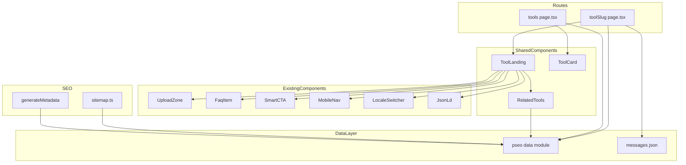
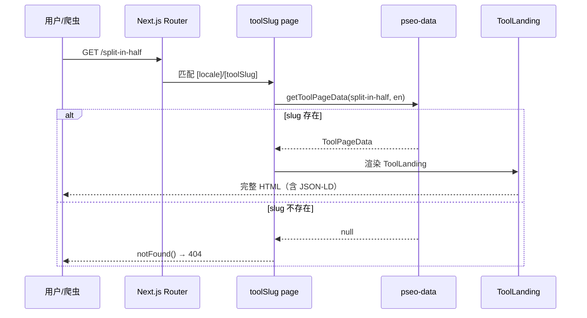
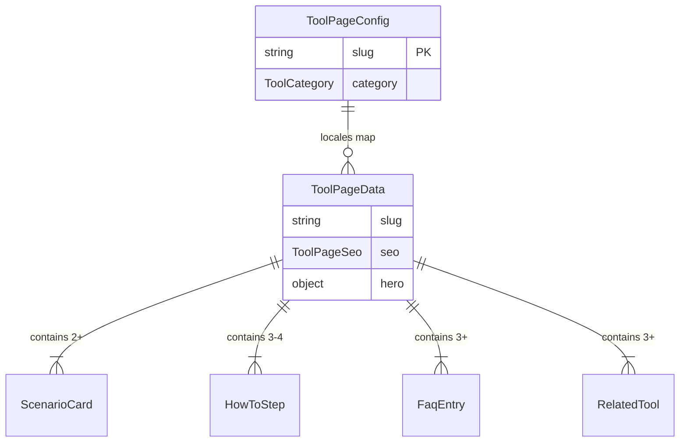

# Design Document

## Overview

**Purpose**: 为 imgsplit.com 新增 9 个程序化 SEO 落地页 + 1 个 Hub 索引页，每个页面针对特定的图片切割搜索意图，嵌入真实工具入口，配合独特 SEO 内容。

**Users**: 通过 Google 搜索"image splitter"、"图片裁剪"等关键词的用户，以及搜索引擎爬虫。

**Impact**: 在现有 2 个公开页面（首页 + grid）基础上扩展到 12 个，将可索引 URL 从 4 个增加到 24 个（含双语）。

### Goals
- 为 9 个不同切割意图提供专属落地页，提升搜索覆盖面
- 每页嵌入真实上传工具，保持工具站而非内容站定位
- 通过 Hub 页和内链矩阵建立完整的站内链接结构
- 所有页面 SSG 静态生成，确保最佳性能和可索引性

### Non-Goals
- 不新增后端 API 或数据库
- 不修改现有工作区（workspace）功能
- 不实现动态内容生成或 CMS 集成
- 不创建 blog/文章类内容页面

## Architecture

### Existing Architecture Analysis

当前系统采用 Next.js App Router + next-intl 的 `[locale]` 前缀路由。已有路由：

```
[locale]/             → 首页（自由分割线工具落地页）
[locale]/grid/        → 网格工具落地页
[locale]/workspace/   → 自由分割线工作区（noindex）
[locale]/grid/workspace/ → 网格工作区（noindex）
```

现有模式：页面为 Server Component，通过 `getTranslations()` 获取 i18n 文本，使用 `JsonLd` 组件注入结构化数据，inline 定义子组件（BenefitCard、StepCard 等）。

### Architecture Pattern & Boundary Map



**Architecture Integration**:
- **Selected pattern**: 数据驱动模板渲染（Data-Driven Template）
- **Domain boundaries**: 数据层（`lib/pseo-data.ts`）与 UI 层（`components/pseo/`）分离
- **Existing patterns preserved**: Server Component + `getTranslations()` + `JsonLd` + inline 子组件
- **New components rationale**: `ToolLanding`（模板）、`ToolCard`（Hub 卡片）、`RelatedTools`（内链）为新增，其余复用
- **Steering compliance**: TypeScript 严格模式、UI 与逻辑分离、Luxury/Editorial 设计风格

### Technology Stack

| Layer | Choice / Version | Role in Feature | Notes |
|-------|------------------|-----------------|-------|
| Frontend | Next.js App Router + React Server Components | 页面路由与 SSG 生成 | 复用现有配置 |
| 样式 | Tailwind CSS v4 + shadcn/ui | 落地页 UI 样式 | 遵循现有设计风格 |
| 国际化 | next-intl | UI chrome 文本 | 复用现有 messages 体系 |
| 数据 | TypeScript 数据模块 | pSEO 页面内容 | 新增 `lib/pseo-data.ts` |
| SEO | Next.js Metadata API + JsonLd 组件 | 元数据与结构化数据 | 复用现有模式 |

## System Flows



## Requirements Traceability

| Requirement | Summary | Components | Interfaces | Flows |
|-------------|---------|------------|------------|-------|
| 1.1, 1.2, 1.3, 1.4, 1.5 | 类型安全数据配置 | pseo-data | ToolPageData, ToolPageConfig | — |
| 2.1, 2.2, 2.3, 2.4 | 动态路由与 SSG | [toolSlug]/page.tsx | generateStaticParams | 路由解析流 |
| 3.1, 3.2, 3.3, 3.4 | 落地页模板 | ToolLanding | ToolLandingProps | — |
| 4.1, 4.2, 4.3 | 切割方向页内容 | pseo-data（direction entries） | ToolPageData | — |
| 5.1, 5.2, 5.3, 5.4 | 场景用例页内容 | pseo-data（use-case entries） | ToolPageData | — |
| 6.1, 6.2, 6.3, 6.4 | Hub 索引页 | tools/page.tsx, ToolCard | ToolCardProps | — |
| 7.1, 7.2, 7.3, 7.4, 7.5 | SEO 元数据 | [toolSlug]/page.tsx generateMetadata | Metadata | — |
| 8.1, 8.2, 8.3 | 内链与站点地图 | RelatedTools, sitemap.ts | RelatedToolsProps | — |
| 8.4 | 首页页脚 Hub 链接 | homepage page.tsx footer | — | — |
| 9.1, 9.2, 9.3 | 国际化 | messages JSON + pseo-data + LocaleSwitcher | LocaleSwitcher | 语言切换流 |
| 10.1, 10.2, 10.3 | 不影响现有 | [toolSlug] 动态路由 | — | 路由优先级 |

## Components and Interfaces

| Component | Domain/Layer | Intent | Req Coverage | Key Dependencies | Contracts |
|-----------|--------------|--------|--------------|-----------------|-----------|
| pseo-data | Data | pSEO 页面内容数据源 | 1, 4, 5 | — | Service |
| [toolSlug]/page.tsx | Route | pSEO 动态路由入口 | 2, 7, 9, 10 | pseo-data (P0), ToolLanding (P0) | State |
| ToolLanding | UI | pSEO 落地页模板组件 | 3 | UploadZone (P0), FaqItem (P1), SmartCTA (P1) | State |
| tools/page.tsx | Route | Hub 索引页 | 2.1, 6 | pseo-data (P0), ToolCard (P1) | — |
| ToolCard | UI | Hub 页工具卡片 | 6.4 | — | — |
| RelatedTools | UI | 相关工具内链区块 | 8.1 | pseo-data (P1) | — |
| sitemap.ts（扩展） | SEO | 站点地图扩展 | 8.3 | pseo-data (P0) | — |

### Data Layer

#### pseo-data

| Field | Detail |
|-------|--------|
| Intent | 集中管理所有 pSEO 页面的内容配置，按 slug + locale 索引 |
| Requirements | 1.1, 1.2, 1.3, 1.4, 1.5, 4.1, 4.2, 4.3, 5.1, 5.2, 5.3, 5.4 |

**Responsibilities & Constraints**
- 提供按 slug + locale 查询页面数据的入口函数
- 所有数据编译时确定，无运行时 I/O
- 确保跨页面 FAQ 和场景描述无重复内容

**Dependencies**
- Outbound: 无（纯数据模块）
- External: 无

**Contracts**: Service [x]

##### Service Interface
```typescript
type ToolCategory = "direction" | "use-case"

interface ScenarioCard {
  icon: string        // Lucide icon name
  title: string
  description: string
}

interface HowToStep {
  stepNumber: number
  title: string
  description: string
}

interface FaqEntry {
  question: string
  answer: string
}

interface RelatedTool {
  slug: string
  title: string
  description: string
}

interface ToolPageSeo {
  title: string
  description: string
  ogTitle: string
  ogDescription: string
}

interface ToolPageData {
  slug: string
  category: ToolCategory
  seo: ToolPageSeo
  hero: {
    overline: string
    headlinePart1: string
    headlineAccent: string
    headlinePart2: string
    description: string
  }
  scenarios: [ScenarioCard, ScenarioCard, ...ScenarioCard[]]  // min 2
  faqEntries: [FaqEntry, FaqEntry, FaqEntry, ...FaqEntry[]]    // min 3
  howToSteps: [HowToStep, HowToStep, HowToStep, ...HowToStep[]]  // min 3
  relatedTools: [RelatedTool, RelatedTool, RelatedTool, ...RelatedTool[]]  // min 3
  platformInfo?: string           // optional, e.g. Instagram dimensions
}

interface ToolPageConfig {
  slug: string
  category: ToolCategory
  locales: Record<string, ToolPageData>  // "en" | "zh-CN"
}

// Public API
function getAllToolSlugs(): string[]
function getToolPageData(slug: string, locale: string): ToolPageData | null
function getAllToolPages(): ToolPageConfig[]
function getToolPagesByCategory(category: ToolCategory): ToolPageConfig[]
```
- Preconditions: slug 和 locale 为有效字符串
- Postconditions: 返回对应数据或 null（slug 不存在时）
- Invariants: 同一 slug 下所有 locale 版本结构一致

### Route Layer

#### [toolSlug]/page.tsx

| Field | Detail |
|-------|--------|
| Intent | pSEO 页面的动态路由入口，负责数据获取、元数据生成和模板渲染 |
| Requirements | 2.1, 2.2, 2.3, 2.4, 7.1, 7.2, 7.3, 7.4, 7.5, 9.1 |

**Responsibilities & Constraints**
- 通过 `generateStaticParams` 枚举所有 slug × locale 组合
- 通过 `generateMetadata` 生成页面级 SEO 元数据
- slug 不存在时调用 `notFound()`
- 渲染 `ToolLanding` 模板 + 3 个 `JsonLd` 结构化数据

**Dependencies**
- Inbound: Next.js Router — 路由匹配 (P0)
- Outbound: pseo-data — 页面数据 (P0), ToolLanding — 渲染 (P0)

**Contracts**: State [x]

##### State Management
```typescript
// generateStaticParams
function generateStaticParams(): Promise<Array<{ locale: string; toolSlug: string }>>
// 返回 getAllToolSlugs() × routing.locales 的笛卡尔积

// generateMetadata
async function generateMetadata(props: { params: Promise<{ locale: string; toolSlug: string }> }): Promise<Metadata>
// 从 pseo-data 获取 seo 字段，生成 title、description、canonical、alternates、openGraph、twitter

// Page Component
async function ToolSlugPage(props: { params: Promise<{ locale: string; toolSlug: string }> }): Promise<React.ReactNode>
// 获取数据 → notFound() 或渲染 ToolLanding + JsonLd × 3
```

#### tools/page.tsx

| Field | Detail |
|-------|--------|
| Intent | Hub 索引页，集中展示所有工具和 pSEO 页面 |
| Requirements | 2.1, 6.1, 6.2, 6.3, 6.4, 8.2 |

**Responsibilities & Constraints**
- 静态路由（优先于 `[toolSlug]`），支持双语
- 按类别分组展示：切割方向、使用场景、已有工具
- 每个工具以 `ToolCard` 形式展示

**Dependencies**
- Inbound: Next.js Router (P0)
- Outbound: pseo-data — 获取所有页面列表 (P0)

**Implementation Notes**
- 已有工具（首页分割工具、网格工具）的 title 和 description 通过 messages JSON 提供，不得硬编码（与 requirement 9.2 一致）
- 页面标题和分类标题通过 messages JSON 提供

### UI Layer

#### ToolLanding

| Field | Detail |
|-------|--------|
| Intent | pSEO 落地页模板组件，接收数据渲染完整页面 |
| Requirements | 3.1, 3.2, 3.3, 3.4, 8.1 |

**Responsibilities & Constraints**
- Server Component，接收 `ToolPageData` + `locale` + `translations`
- 渲染区块顺序：Nav → Hero → Upload → Scenarios → HowTo → FAQ → RelatedTools → Footer
- 复用现有组件：UploadZone、FaqItem、SmartCTA、MobileNav、LocaleSwitcher、LogoIcon、GridLines
- 遵循 Luxury/Editorial 设计风格
- 导航栏和页脚区块遵循与首页一致的视觉结构。ToolLanding 通过 `t` prop 接收所有必要的翻译文本。
- LocaleSwitcher 处理 requirement 9.3（语言切换导航）

**Dependencies**
- Inbound: [toolSlug]/page.tsx — 数据传入 (P0)
- Outbound: UploadZone (P0), FaqItem (P1), SmartCTA (P1), MobileNav (P1), LocaleSwitcher (P1), RelatedTools (P1)

```typescript
interface NavTranslations {
  features: string; howItWorks: string; faq: string; getStarted: string; menu: string; close: string
}
interface UploadSectionTranslations { overline: string }
interface FooterTranslations {
  tagline: string; toolsTitle: string; toolGrid: string; toolSplit: string
  navTitle: string; navFeatures: string; navHowItWorks: string; navFaq: string
}
interface PseoChrome {
  scenariosTitle: string; howItWorksTitle: string; faqTitle: string; relatedToolsTitle: string
  ctaButton: string
}

interface ToolLandingProps {
  data: ToolPageData
  locale: string
  // UI chrome translations passed from page via getTranslations()
  t: {
    nav: NavTranslations
    uploadSection: UploadSectionTranslations
    footer: FooterTranslations
    pseoChrome: PseoChrome  // 通用区块标题如 "How It Works"、"FAQ"
  }
}
```

**Implementation Notes**
- Scenarios 区块：2-3 张卡片，使用与首页 BenefitCard 相同的样式模式
- HowTo 区块：复用首页 StepCard 样式模式（大数字 + 标题 + 描述）
- FAQ 区块：使用 FaqItem 组件
- platformInfo 有值时，在 Hero 区下方渲染参考信息框

#### ToolCard（Summary-only）

| Field | Detail |
|-------|--------|
| Intent | Hub 页工具卡片，展示工具名称、描述和链接 |
| Requirements | 6.4 |

```typescript
interface ToolCardProps {
  title: string
  description: string
  href: string
  icon?: React.ReactNode
}
```

**Implementation Notes**: 使用 `border-t border-border` + hover accent 样式，与首页 FeatureCard 一致

#### RelatedTools（Summary-only）

| Field | Detail |
|-------|--------|
| Intent | 页面底部相关工具内链区块 |
| Requirements | 8.1 |

```typescript
interface RelatedToolsProps {
  tools: RelatedTool[]
  locale: string
}
```

**Implementation Notes**: 水平排列 3-4 个链接卡片，使用 `Link` 组件（`@/i18n/navigation`）确保 locale 前缀正确

#### sitemap.ts（扩展）

**Implementation Notes**: 站点地图同时包含 Hub 索引页（`/tools`）的 URL 及其语言替代链接。Requirement 8.4: 首页 `page.tsx` 的页脚区块需新增指向 `/tools` 的链接。

## Data Models

### Domain Model



**Invariants**:
- 每个 ToolPageConfig 必须包含 "en" 和 "zh-CN" 两个 locale 的 ToolPageData
- 所有 slug 在全局范围内唯一，不与现有路由（grid, workspace, tools）冲突
- 跨页面 FAQ question 字段不得完全重复

### Logical Data Model

**纯编译时数据**：所有 pSEO 数据在 `lib/pseo-data.ts` 中以 TypeScript 常量定义，无运行时存储。数据在构建时被 `generateStaticParams` 和 `generateMetadata` 消费，最终嵌入静态 HTML。

**Physical Data Model 和 Data Contracts**: 不适用 — 所有 pSEO 数据为编译时 TypeScript 常量，无外部存储或跨服务集成。

## Error Handling

### Error Strategy
- **Invalid slug**: `getToolPageData()` 返回 `null` → page.tsx 调用 `notFound()` → Next.js 404 页面
- **Missing locale data**: TypeScript 编译时检查，不会在运行时出现
- **Empty scenarios/FAQ**: 运行时验证函数在构建时数据加载阶段检查最小长度约束

### Error Categories and Responses
- **User Errors (404)**: 访问不存在的 toolSlug → 现有 404 页面
- **System Errors**: 无（纯静态页面，无运行时逻辑）

### Monitoring
不适用 — 纯静态页面无运行时错误。构建失败通过 CI 输出捕获；运行时 404 由现有错误监控追踪。

## Testing Strategy

### Build Verification
- 构建成功完成，所有 18 个 pSEO 静态页面（9 slug × 2 locale）正确生成
- 现有页面（首页、grid、workspace）路由和内容不受影响
- sitemap.xml 包含所有 pSEO URL（含 alternates 和 x-default）

### Content Validation
- 每个 pSEO 页面的 title tag 包含目标关键词
- 每个页面的 JSON-LD（FAQPage、HowTo、SoftwareApplication）结构合法
- 跨页面 FAQ 无重复内容

### Unit Tests
- `getToolPageData()` 传入未知 slug 返回 null
- `getAllToolSlugs()` 返回全部 9 个 slug
- `getToolPagesByCategory("direction")` 返回 4 个切割方向页配置
- `generateStaticParams()` 产生 `locales.length × slugs.length` 个条目

### Integration Tests
- 访问有效 pSEO slug 返回 200 和完整 HTML（含 JSON-LD）
- 访问无效 slug 返回 404
- sitemap.xml 包含所有 pSEO URL（含 hreflang 和 x-default）
- 语言切换后 URL 保持同一 slug，locale 前缀正确变化

### SEO Verification
- 每个页面有独立的 canonical URL
- hreflang 标签正确指向对应语言版本
- x-default 指向英文版本
- Open Graph 和 Twitter Card 使用独立标题和描述

## Performance & Scalability

- **构建时间影响**: 新增 18 个静态页面，预计构建时间增加 < 5 秒
- **运行时性能**: 纯静态 HTML，与现有页面性能一致（CDN 缓存）
- **扩展性**: 新增页面只需在 `pseo-data.ts` 中添加配置，无需修改模板或路由
