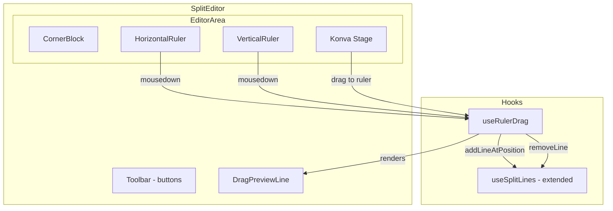
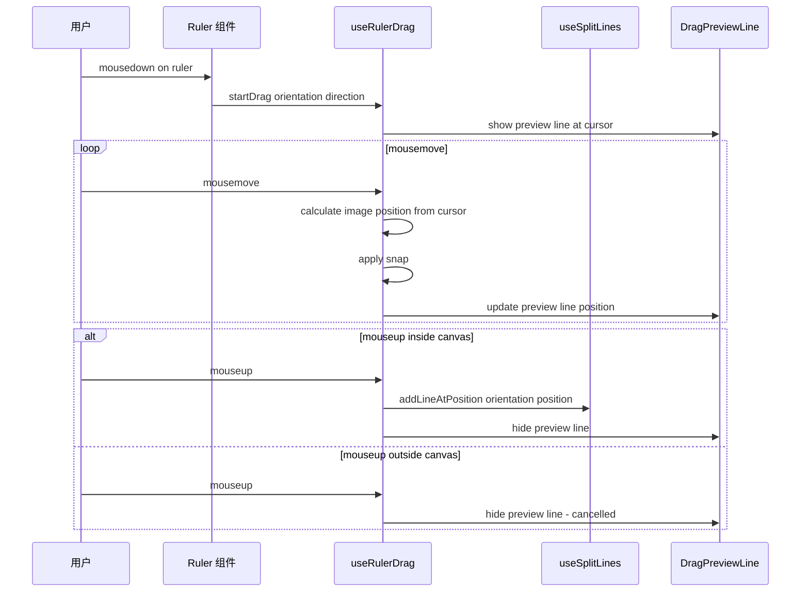
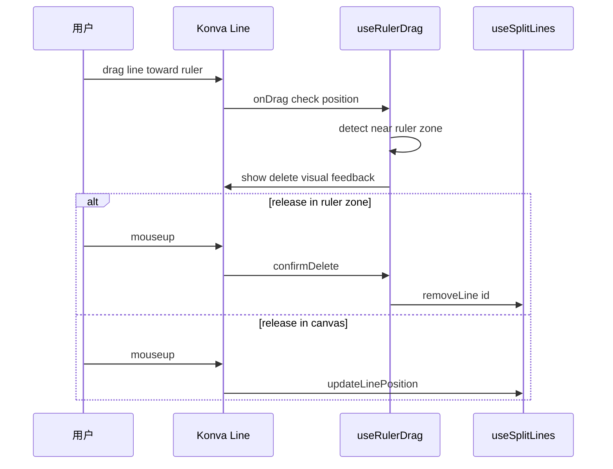

# 技术设计文档

## 概述

**目的**: 本特性为图片分割编辑器添加类 Figma 的标尺组件和拖拽创建辅助线功能，替代现有的纯按钮创建方式。

**用户**: 设计师和内容创作者通过从标尺区域拖拽辅助线，以更直观的方式完成图片分割线布局。

**影响**: 修改 `SplitEditor` 布局结构（添加标尺区域），扩展 `useSplitLines` hook 接口（支持指定位置创建线），新增标尺渲染和拖拽交互组件。

### 目标
- 在画布上方和左侧渲染动态刻度标尺
- 支持从标尺拖拽创建辅助线（含预览、磁吸）
- 支持拖拽辅助线回标尺区域删除
- 在标尺上显示已有辅助线的位置指示器
- 保持与现有按钮创建方式的兼容

### 非目标
- 画布平移/缩放功能（当前无此功能，不在本次范围内）
- 标尺单位切换（始终使用像素）
- 标尺自定义样式/主题

## 架构

### 现有架构分析

当前 `SplitEditor` 直接渲染一个 Konva `<Stage>`，无标尺元素。辅助线通过工具栏按钮创建，总是放置在图片中心。布局结构：

```
┌──────────────────────────┐
│ Toolbar (buttons)        │
├──────────────────────────┤
│                          │
│    Konva Stage           │
│    (image + lines)       │
│                          │
└──────────────────────────┘
```

### 架构模式与边界

新布局结构引入标尺区域，形成 L 型包围：

```
┌──────────────────────────┐
│ Toolbar (buttons)        │
├────┬─────────────────────┤
│ CB │  HorizontalRuler    │
├────┼─────────────────────┤
│    │                     │
│ VR │   Konva Stage       │
│    │   (image + lines)   │
│    │                     │
└────┴─────────────────────┘
CB = Corner Block, VR = VerticalRuler
```



**架构集成**:
- 选定模式: 组件组合 + 自定义 Hook，符合现有架构模式
- 新组件: `Ruler`（HTML Canvas 渲染）、`useRulerDrag`（拖拽状态管理）
- 保持模式: UI/逻辑分离、hooks 封装交互逻辑、类型安全
- Steering 合规: 遵循功能优先目录组织、单一职责原则

### 技术栈

| 层 | 选择 / 版本 | 在本特性中的角色 | 备注 |
|---|---|---|---|
| 前端 | React 19 + Next.js | 组件渲染和状态管理 | 现有 |
| Canvas 交互 | Konva.js + react-konva | 辅助线拖拽（Stage 内） | 现有 |
| 标尺渲染 | HTML Canvas 2D API | 标尺刻度和数字绘制 | 新增，浏览器原生 API |
| 拖拽交互 | DOM mousedown/mousemove/mouseup | 跨标尺-Stage 拖拽 | 新增，无额外依赖 |

## 系统流程

### 从标尺拖拽创建辅助线



### 拖拽辅助线回标尺删除



## 需求追溯

| 需求 | 摘要 | 组件 | 接口 | 流程 |
|------|------|------|------|------|
| 1.1 | 显示水平和垂直标尺 | Ruler | RulerProps | - |
| 1.2 | 动态调整刻度间距 | Ruler | scale prop | - |
| 1.3 | 显示原始像素坐标 | Ruler | imageWidth/imageHeight | - |
| 1.4 | 缩放时同步更新标尺 | Ruler | scale prop 响应式 | - |
| 1.5 | 左上角静态角块 | CornerBlock | - | - |
| 2.1 | 水平标尺拖出水平线 | Ruler, useRulerDrag | startDrag | 创建流程 |
| 2.2 | 垂直标尺拖出垂直线 | Ruler, useRulerDrag | startDrag | 创建流程 |
| 2.3 | 画布内释放固定 | useRulerDrag | addLineAtPosition | 创建流程 |
| 2.4 | 画布外释放取消 | useRulerDrag | cancelDrag | 创建流程 |
| 2.5 | 拖拽时显示预览线 | DragPreviewLine | DragPreviewProps | 创建流程 |
| 2.6 | 磁吸兼容 | useRulerDrag | calculateSnap | 创建流程 |
| 3.1 | 保持现有拖拽功能 | Konva Line | 现有接口 | - |
| 3.2 | 拖回标尺删除 | useRulerDrag | onLineDragEnd | 删除流程 |
| 3.3 | 删除视觉反馈 | useRulerDrag | nearRulerZone 状态 | 删除流程 |
| 4.1 | 数量上限阻止创建 | useRulerDrag | canAddH/V | - |
| 4.2 | 标尺上显示辅助线标记 | Ruler | lines prop | - |
| 5.1 | 保留按钮功能 | SplitEditor | 现有接口 | - |
| 5.2 | 按钮创建同步标尺标记 | Ruler | lines prop 响应式 | - |

## 组件与接口

| 组件 | 领域/层 | 职责 | 需求覆盖 | 关键依赖 | 契约 |
|------|---------|------|----------|----------|------|
| Ruler | UI | 渲染标尺刻度、辅助线标记、触发拖拽 | 1.1-1.5, 2.1-2.2, 4.2, 5.2 | useRulerDrag (P0) | State |
| useRulerDrag | Hook | 管理拖拽状态、坐标转换、创建/删除辅助线 | 2.1-2.6, 3.2-3.3, 4.1 | useSplitLines (P0) | State |
| DragPreviewLine | UI | 渲染拖拽时的预览线 | 2.5 | useRulerDrag (P0) | - |
| CornerBlock | UI | 渲染左上角静态角块 | 1.5 | - | - |
| useSplitLines (扩展) | Hook | 新增 addLineAtPosition 方法 | 2.3 | 现有 (P0) | State |

### UI 层

#### Ruler

| 字段 | 详情 |
|------|------|
| 职责 | 渲染水平/垂直标尺的刻度、数值和辅助线位置标记 |
| 需求 | 1.1, 1.2, 1.3, 1.4, 2.1, 2.2, 4.2, 5.2 |

**职责与约束**
- 使用 HTML `<canvas>` 元素渲染标尺刻度和数字
- 根据 scale 和 devicePixelRatio 计算刻度间距
- 在辅助线位置绘制三角形标记指示器
- 触发 `onDragStart` 回调将拖拽控制权交给 `useRulerDrag`

**依赖**
- Inbound: SplitEditor — 提供 scale、imageWidth/Height、lines (P0)
- Outbound: useRulerDrag — onDragStart 回调 (P0)

**契约**: State [x]

##### 状态管理

```typescript
interface RulerProps {
  /** 标尺方向 */
  orientation: "horizontal" | "vertical"
  /** 标尺长度（屏幕像素） */
  length: number
  /** 当前缩放比例 */
  scale: number
  /** 原始图片尺寸（像素） */
  imageSize: number
  /** 标尺厚度（像素），默认 20 */
  thickness?: number
  /** 当前辅助线列表（用于绘制标记） */
  lines: SplitLine[]
  /** 从标尺开始拖拽时的回调 */
  onDragStart: (orientation: "horizontal" | "vertical") => void
}
```

**实现备注**
- 刻度间距算法: 根据 `scale` 计算基础步长，选择 10/50/100/500 等合理刻度
- 标记指示器: 在辅助线对应位置绘制小三角形（▼ 水平标尺 / ▶ 垂直标尺）
- 高 DPI 处理: canvas 实际尺寸 = 显示尺寸 × devicePixelRatio

#### DragPreviewLine

| 字段 | 详情 |
|------|------|
| 职责 | 在拖拽过程中渲染半透明预览线 |
| 需求 | 2.5 |

**实现备注**: 绝对定位 div，覆盖整个编辑区域，宽度/高度 1-2px，背景色半透明蓝色。由 `useRulerDrag` 状态驱动显示/隐藏和位置。

```typescript
interface DragPreviewLineProps {
  /** 是否正在拖拽 */
  isDragging: boolean
  /** 拖拽方向 */
  orientation: "horizontal" | "vertical"
  /** 预览线位置（相对编辑区域的屏幕像素） */
  position: number
  /** 编辑区域容器引用 */
  containerRef: React.RefObject<HTMLDivElement>
}
```

#### CornerBlock

| 字段 | 详情 |
|------|------|
| 职责 | 渲染标尺交汇处的静态角块 |
| 需求 | 1.5 |

**实现备注**: 固定尺寸 div（与标尺厚度相同），背景色与标尺一致。无交互逻辑，纯展示组件。

### Hook 层

#### useRulerDrag

| 字段 | 详情 |
|------|------|
| 职责 | 管理从标尺拖拽创建辅助线的完整生命周期，以及拖拽已有辅助线到标尺区域删除的判定 |
| 需求 | 2.1-2.6, 3.2, 3.3, 4.1 |

**职责与约束**
- 监听全局 mousemove/mouseup 事件管理拖拽状态
- 将屏幕坐标转换为图片像素坐标
- 调用 `calculateSnap` 应用磁吸逻辑
- 判定释放位置是否在画布区域内
- 判定辅助线拖拽是否进入标尺区域（删除判定）

**依赖**
- Inbound: Ruler 组件 — onDragStart 触发 (P0)
- Outbound: useSplitLines — addLineAtPosition / removeLine (P0)

**契约**: State [x]

##### 状态管理

```typescript
interface UseRulerDragOptions {
  /** 编辑区域容器 ref（用于坐标计算和边界判定） */
  editorRef: React.RefObject<HTMLDivElement>
  /** Stage 容器 ref（用于画布区域判定） */
  stageRef: React.RefObject<HTMLDivElement>
  /** 当前缩放比例 */
  scale: number
  /** 辅助线操作方法 */
  addLineAtPosition: (orientation: "horizontal" | "vertical", position: number) => void
  removeLine: (id: string) => void
  calculateSnap: (position: number, orientation: "horizontal" | "vertical") => number
  canAddHorizontal: boolean
  canAddVertical: boolean
  /** 标尺厚度（像素） */
  rulerThickness: number
}

interface UseRulerDragReturn {
  /** 拖拽状态 */
  isDragging: boolean
  /** 拖拽方向 */
  dragOrientation: "horizontal" | "vertical" | null
  /** 预览线位置（屏幕像素，相对编辑区域） */
  previewPosition: number
  /** 开始拖拽（由 Ruler onDragStart 触发） */
  startDrag: (orientation: "horizontal" | "vertical") => void
  /** 检查辅助线拖拽是否接近标尺区域（用于删除判定） */
  isNearRulerZone: (lineId: string, currentScreenPos: number, orientation: "horizontal" | "vertical") => boolean
}
```

**实现备注**
- 坐标转换: `imagePos = (screenPos - stageRect.left) / scale`（水平），类似垂直
- 画布区域判定: 使用 `stageRef.getBoundingClientRect()` 判断 mouseup 位置
- 标尺区域判定: 水平线 — y 坐标 < rulerThickness 时视为进入水平标尺区域；垂直线 — x 坐标 < rulerThickness
- 清理: 在 mouseup 和组件卸载时移除全局事件监听

#### useSplitLines（扩展）

| 字段 | 详情 |
|------|------|
| 职责 | 扩展现有 hook，新增在指定位置创建辅助线的方法 |
| 需求 | 2.3 |

**新增接口**:

```typescript
// 在现有 UseSplitLinesReturn 中新增
interface UseSplitLinesReturn {
  // ... 现有方法保持不变
  /** 在指定位置创建辅助线 */
  addLineAtPosition: (orientation: "horizontal" | "vertical", position: number) => void
}
```

**实现备注**
- `addLineAtPosition` 与现有 `addLine` 逻辑相同，区别在于使用传入的 `position` 而非 `imageSize / 2`
- 同样检查 `maxLinesPerDirection` 限制
- 同样使用 `clampPosition` 确保位置在有效范围内
- 通过 `setLinesWithHistory` 添加以支持 undo/redo

## 数据模型

### 领域模型

无新增类型。现有 `SplitLine` 接口完全满足需求，标尺拖拽创建的辅助线与按钮创建的辅助线使用相同的数据结构。

拖拽状态为瞬态 UI 状态，不需要持久化：

```typescript
/** 拖拽状态（useRulerDrag 内部） */
interface RulerDragState {
  isDragging: boolean
  orientation: "horizontal" | "vertical" | null
  /** 当前预览位置（图片像素坐标） */
  imagePosition: number
  /** 当前预览位置（屏幕像素，相对编辑区域） */
  screenPosition: number
}
```

## 错误处理

### 错误策略
本特性为纯客户端 UI 交互，无网络请求或外部服务依赖，错误场景有限。

### 错误类别与响应
- **数量上限** (4.1): 从标尺拖拽时检查 `canAddHorizontal/canAddVertical`，达到上限时使用 `toast.error` 提示用户并取消拖拽
- **画布外释放** (2.4): 不视为错误，静默取消拖拽，无提示
- **图片未加载**: 标尺组件在 `image` 为 null 时不渲染，无需额外处理

## 测试策略

### 单元测试
- `useSplitLines.addLineAtPosition`: 验证指定位置创建、边界 clamp、上限检查
- 标尺刻度计算逻辑: 验证不同 scale 下的刻度间距和数值
- 坐标转换: 验证屏幕坐标到图片坐标的转换精度

### 集成测试
- 从标尺拖拽创建辅助线完整流程（含磁吸）
- 拖拽辅助线回标尺删除流程
- 按钮创建后标尺标记同步更新
- undo/redo 与标尺拖拽创建的兼容性

### E2E 测试
- 完整用户路径: 上传图片 → 从标尺拖出辅助线 → 调整位置 → 拖回删除 → 生成分割

## 性能与可扩展性

- **标尺重绘**: Canvas 2D 绘制在 scale 或 lines 变化时触发，使用 `useEffect` + `requestAnimationFrame` 确保不超过一帧一次重绘
- **拖拽帧率**: mousemove 事件使用 `requestAnimationFrame` 节流，确保 60fps 预览更新
- **DPR 适配**: Canvas 尺寸按 `devicePixelRatio` 缩放以确保高 DPI 屏幕清晰度
